# Лабораторная работа №6
## Система контроля версий
**Выполнила:** Павлушова А., группа 4511в

### Цель работы
Изучение базовых возможностей системы управления версиями, опыт работы с Git Api, опыт работы с локальным и удаленным репозиторием. 

### 1. Задание на выполнение практической работы
1. Создать аккаунт GitHub
2. Выполнить Fork исходного репозитория
3. Установить и настроить Git
4. Выполнить клонирование удалённого репозитория
5. Добавить файл через интерфейс GitHub
6. Выполнить синхронизация локального репозитория с GitHub с помощью git pull
7. Создать дополнительную ветку
8. Выполнить изменения и создать коммиты.
9. Выполнить слияние веток и разрешить конфликт.
10. Удалить дополнительную ветку.
11. Выполнить несколько последовательных коммитов.
12. Выполнить откат последнего коммита с помощью git revert.
13. Создать ветку report для оформления отчёта.

### 2. Выполнение работы
#### 2.1 Создание аккаунта на GitHub и копирование в личное хранилище
Был создан аккаунт GitHub. После этого выполнен Fork исходного репозитория `Kurtyanik/LR6`.
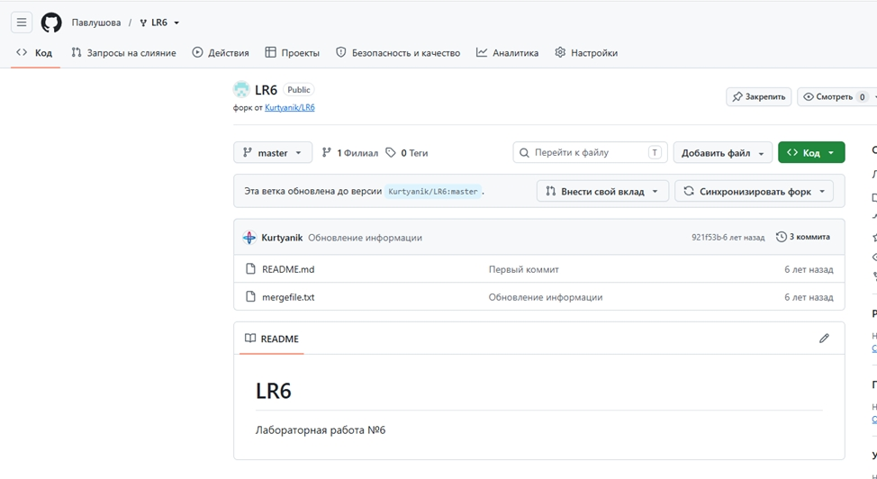

#### 2.2 Настройка Git
После установки Git были настроены имя пользователя и электронная почта. 
Использовались команды: 
```text 
git config --global user.name "4511в Павлушова А.А" 
git config --global user.email "pavlushova.12mini@mail.ru"
```
Результат показан на рисунке 2.
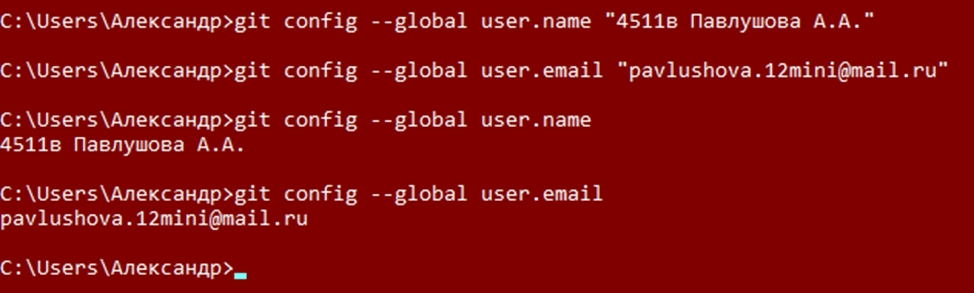

#### 2.3 Клонирование удаленного репозитория
Личный удалённый репозиторий был склонирован на локальный компьютер.
Использовалась команда: 
git clone https://github.com/Pavlushova/LR6.git
После клонирования было проверено состояние репозитория:
```text
git status
```
Результат показан на рисунке 3.
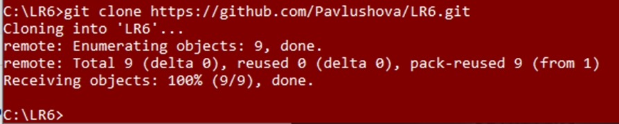

#### 2.4 Добавление файла
Через интерфейс GitHub был создан файл test.txt. Результат показан на рисунке 4.
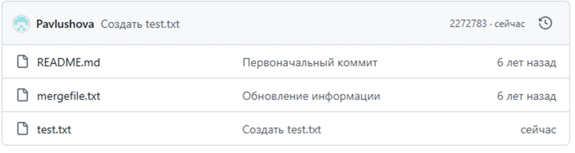

#### 2.5 История операций и последние изменения
Для получения изменений из удалённого репозитория была выполнена команда:
git pull
Для просмотра истории операций использовалась команда:
git log --oneline
Результат показан на рисунке 5
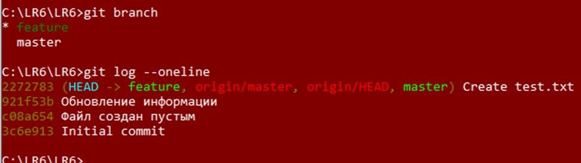

#### 2.6 Слияние веток с разрешенным конфликтом
Для начала в двух ветках сделали изменения, чтобы потом специально получить конфликт и его разрешить.
Для этого применили команды для создания двух веток:
```text
git branch feature
git checkout feature
```
В ветке feature был изменён файл mergefile.txt, после чего изменения были сохранены:
```text
git add mergefile.txt
git commit -m "Изменение файла в feature :)"
```
Изменение файлов можно посмотреть в папке, где храняться скриншоты работы
Для объединения веток была выполнена команда:
git merge feature
При слиянии возник конфликт, так как один и тот же файл был изменён в обеих ветках. Конфликт был разрешён вручную.
Получение конфликта получено на рисунке 6
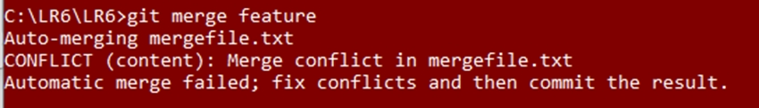
Затем, конфликт был разрешен. Результат показан на рисунке 7.
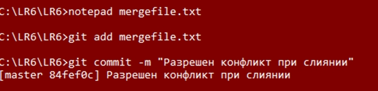
```text
git add mergefile.txt
git commit -m "Разрешен конфликт при слиянии"
```
#### 2.7 Удаление ветки
После успешного слияния ветка feature была удалена с помощью 
git branch -d feature
Результат показан на рисунке 8.
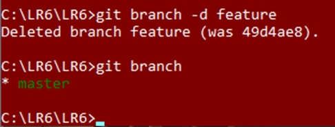

#### 2.8 Создание нескольких коммитов
Для демонстрации работы с историей изменений был создан файл change.txt.
В файл последовательно вносились изменения. После каждого изменения создавался отдельный коммит
К примеру:
"git add change.txt
git commit -m "Первое важное изменение""
История изменений была просмотрена с помощью команды 
```text
git log --oneline
```
История изменений показана на рисунке 9.
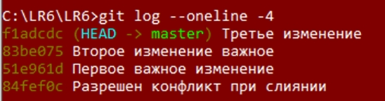

#### 2.9 Отмена последнего изменения
Для отмены последнего коммита была использована команда: git revert f1adcdc
Результат показан на рисунке 10.
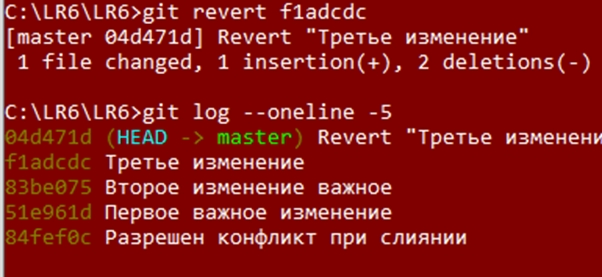

#### 2.10 Создание ветки 
Для оформления отчёта была создана отдельная ветка report
git checkout -b report
Результат показан на рисунке 11.
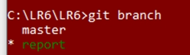

### 3. Лог команд 
```text
git config --global user.name "4511в Павлушова А.А"
git config --global user.email "pavlushova.12mini@mail.ru"

git clone https://github.com/Pavlushova/LR6.git
git status

git pull
git log --oneline

git branch feature
git checkout feature

git add mergefile.txt
git commit -m "Изменение файла в feature :)"

git checkout master

git add mergefile.txt
git commit -m "Изменение файла в master :D"

git merge feature

git add mergefile.txt
git commit -m "Разрешен конфликт при слиянии"

git branch -d feature

git add change.txt
git commit -m "Первое важное изменение"

git add change.txt
git commit -m "Второе изменение важное"

git add change.txt
git commit -m "Третье изменение"

git log --oneline

git revert f1adcdc

git log --oneline

git checkout -b report
```
### 4. История операций 
Для получения истории операций в требуемом формате была использована команда:

git log --pretty=format:"%h | %ad | %an | %s" --date=short

Полученная история операций:

04d471d | 2026-10-07 | 4511в Павлушова А.А. | Revert "Третье изменение"
f1adcdc | 2026-10-07 | 4511в Павлушова А.А. | Третье изменение
83be075 | 2026-10-07 | 4511в Павлушова А.А. | Второе изменение важное
51e961d | 2026-10-07 | 4511в Павлушова А.А. | Первое важное изменение
84fef0c | 2026-10-07 | 4511в Павлушова А.А. | Разрешен конфликт при слиянии
cffebc4 | 2026-10-07 | 4511в Павлушова А.А. | Изменение файла в master :D
49d4ae8 | 2026-10-07 | 4511в Павлушова А.А. | Изменение файла в feature :)
2272783 | 2026-10-07 | Pavlushova | Create test.txt
921f53b | 2020-11-21 | Kurtyanik | Обновление информации
c08a654 | 2020-11-21 | Kurtyanik | Файл создан пустым
3c6e913 | 2020-11-21 | Kurtyanik | Initial commit
